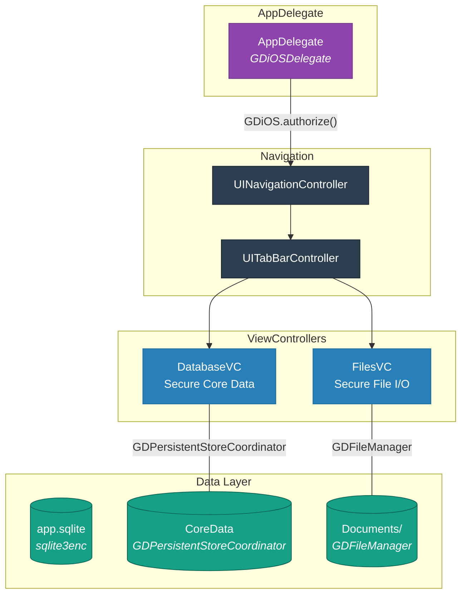
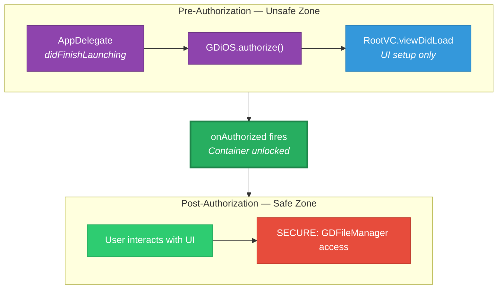
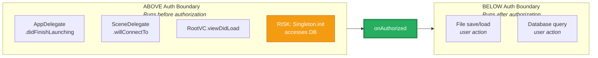

# Task: Generate Architectural Diagrams for iOS Dynamics Migration

## Execution Order

Run immediately after `00-analyze-app.md`. Do NOT modify any source code.

Output: `dynamics-migration-tool/output/architecture-diagrams.md`

**IMPORTANT — File Write Method**: Use a **full-file overwrite** (not a
patch or append) to create the output file. In AI IDEs, use the
Write/CreateFile tool — do NOT use StrReplace or patch-based tools. If
the file already exists from a previous run, the full-file write will
correctly replace it.

---

## Why This Step Exists

Import-swapping is mechanical. The hard part is understanding the
transitive dependency chains that lead to secure API calls during early
initialization. Crashes come from `viewDidLoad` methods that open
databases, SwiftUI views that access secure storage on `.onAppear`,
Combine pipelines that fire before authorization, singletons whose
`init()` opens the database, and `SceneDelegate` setup that reads policy.
A flat API inventory does not reveal these chains. The diagrams below do.

**SwiftUI trap**: `@StateObject` initializers run during view body
evaluation, which may happen before authorization. If the initializer
accesses the secure container, it crashes.

**Combine trap**: Publishers connected in `init()` or `viewDidLoad()`
can fire before authorization if the upstream emits synchronously.

**This output is consumed by**:
- Prompt 03 (auth initialization) — identifies AppDelegate/SceneDelegate restructuring
- Prompt 03b (deferral audit) — primary input, maps every pre-auth chain to a deferral pattern
- Prompt 04 (secure SQL) — identifies which sqlite3 access points need deferral
- Prompt 04b (Core Data) — identifies NSPersistentContainer setup timing
- Prompt 05 (secure filesystem) — identifies which file I/O needs deferral
- Prompt 10 (migration report) — risk heatmap feeds into report risk assessments

If this output is incomplete, downstream prompts will miss pre-auth chains
and the migrated app will crash at runtime.

---

# STRICT OUTPUT CONTRACT

The output file MUST contain these sections in order:

0. Application Architecture Overview (Mermaid — component diagram)
1. Data Flow Diagrams (Mermaid — one per distinct flow)
2. Storage Classification Map (Tables)
3. Network Classification Map (Table)
4. Lifecycle Dependency Map (Text Tree + Summary Table + Mermaid)
5. Secure API Call Graph (Mermaid — bottom-up, split by domain)
6. Authorization Boundary (Mermaid diagram + structured prose)
7. Migration Risk Heatmap (Table)
8. Migration API Replacement Map (Mermaid + Table)

Rules:
- No prose explanations outside section headers and structured annotations
- Only structured output (tables, trees, Mermaid, blockquote annotations, lists)
- If information is unknown, write: `UNKNOWN — requires manual review`

---

# STYLING AND PRESENTATION RULES

## Tone

Professional, no emoji or unicode pictographs anywhere in the output.
Use plain-text prefixes and Mermaid color styling to convey meaning.

## Node Label Conventions

Use plain-text prefixes instead of emoji markers:

| Prefix | Meaning | classDef name |
|--------|---------|---------------|
| `SECURE:` | Requires Dynamics API replacement | `secure` |
| `RISK:` | Executes before authorization, potential crash | `risk` |
| `LIB:` | Third-party library in the data path | `lib` |
| *(no prefix)* | Standard application code | varies by role |

## Mandatory classDef Palette

Every Mermaid diagram MUST define its applicable classes from this
palette. Use `classDef` (not per-node `style` directives) for
consistency across all diagrams. Only use per-node `style` for
subgraph background coloring.

```
classDef lifecycle fill:#3498db,color:#fff,stroke:#2980b9
classDef userAction fill:#2ecc71,color:#fff,stroke:#27ae60
classDef secure fill:#e74c3c,color:#fff,stroke:#c0392b
classDef io fill:#e67e22,color:#fff,stroke:#d35400
classDef risk fill:#f39c12,color:#fff,stroke:#d35400
classDef ui fill:#95a5a6,color:#fff,stroke:#7f8c8d
classDef authGate fill:#27ae60,color:#fff,stroke:#1e8449,stroke-width:3px
classDef appDel fill:#8e44ad,color:#fff,stroke:#6c3483
classDef vcNode fill:#2c3e50,color:#fff,stroke:#1a252f
```

Role assignment:
- **lifecycle** (blue): iOS lifecycle entry points — viewDidLoad, viewWillAppear, onAppear, didFinishLaunchingWithOptions
- **userAction** (green): User-triggered events — button taps, menu selections
- **secure** (red): Nodes touching secure APIs — label with `SECURE:` prefix
- **io** (orange): I/O operations, intermediary method calls
- **risk** (amber): Pre-auth execution risk — label with `RISK:` prefix
- **ui** (gray): UI updates — setText, configure cell, adapter reload
- **authGate** (green, thick border): The `onAuthorized` / `GDAppEventAuthorized` boundary node
- **appDel** (purple): AppDelegate / SceneDelegate class
- **vcNode** (dark): ViewController-level nodes

---

# 0. Application Architecture Overview (MANDATORY MERMAID)

Produce a `graph TD` component diagram that shows the full app structure
at a glance: AppDelegate, navigation layer, ViewControllers or SwiftUI
views, and the data layer each connects to.

### Format Requirements

- Use `graph TD` (top-down)
- Four subgraphs: **AppDelegate/SceneDelegate**, **Navigation**,
  **ViewControllers/Views**, **Data Layer**
- Color-code by role using `classDef`: `appDel` (purple) for AppDelegate,
  `nav` (dark) for navigation, `vc` (blue) for ViewControllers/views,
  `data` (teal) for data layer
- Database nodes should use cylinder shape `[("label")]`
- Connect AppDelegate to navigation with labeled edges showing init calls
  (`GDiOS.authorize`, `setDelegate`)
- Connect navigation to ViewControllers/views
- Connect ViewControllers to Data Layer with labeled edges showing the
  **post-migration** Dynamics API used (e.g., `GDFileManager`,
  `sqlite3enc`, `GDPersistentStoreCoordinator`)

### Example



---

# 1. Data Flow Diagrams (MANDATORY MERMAID)

For EACH distinct data flow in the app, produce one Mermaid `flowchart LR`.

### Format Requirements

- Use `flowchart LR` (left-to-right)
- One Mermaid block per distinct flow — do not collapse multiple flows
- Use `Class.method` naming for all nodes
- Apply `classDef` classes to every node based on its role (lifecycle,
  userAction, secure, io, risk, ui)
- Mark every node that touches a secure API with the `SECURE:` text
  prefix and the `secure` class
- Mark every third-party library node with the `LIB:` text prefix
- Mark every node that runs before authorization with the `RISK:` text
  prefix and the `risk` class
- Use dashed edges (`-.->`) for system-triggered or asynchronous paths

### Per-Flow Annotations (below each Mermaid block)

After each diagram, add annotations as a blockquote with two mandatory
lines and one optional line:
- **Dynamics impact:** which nodes require Dynamics API replacement
- **Third-party:** libraries in the path and container compatibility
  (can it read from the secure container directly, or does it need a
  workaround?)
- **Risk:** *(optional — include only if pre-auth execution is possible)*

### Example


> **Dynamics impact:** GDFileManager.createFile (file storage), sqlite3enc_open (encrypted SQLite)
> **Third-party:** Kingfisher cannot load from GD secure container — needs Data/byte workaround

---

# 2. Storage Classification Map (TABLES ONLY)

Produce sub-tables for each applicable category. Every storage location
in the app must appear in exactly one table. No missing categories.

## SQLite / sqlite3enc

| Name | Technology | Sensitivity | Pre-Auth? | Migration Target |
|------|-----------|-------------|-----------|-----------------|

## Core Data

| Store Name | Technology | Sensitivity | Pre-Auth? | Migration Target |
|-----------|-----------|-------------|-----------|-----------------|

## File Storage

| Path | Operation | Sensitivity | Pre-Auth? | Migration Target |
|------|-----------|-------------|-----------|-----------------|

## UserDefaults

If entries exist:

| Suite/Key | Sensitivity | Pre-Auth? | Migration Target |
|-----------|-------------|-----------|-----------------|

If none detected, use a single-row status table:

| Status |
|--------|
| No sensitive UserDefaults usage detected — no migration required |

## Cache / Temp Files

If entries exist:

| Path Pattern | Sensitivity | Pre-Auth? | Migration Target |
|-------------|-------------|-----------|-----------------|

If none detected:

| Status |
|--------|
| None detected — no leakage risk |

Column rules:
- `Pre-Auth?` must be YES or NO, optionally with a brief qualifier
  (e.g., "NO — button-triggered")
- `Sensitivity` must be one of: Sensitive, Semi-sensitive, Non-sensitive, Transient
- `Migration Target` must name the specific Dynamics API or state
  "Keep native" with justification

---

# 3. Network Classification Map (TABLE ONLY)

| Component | Technology | Endpoint | Trigger | Pre-Auth? | Migration Target |
|-----------|-----------|----------|---------|-----------|-----------------|

Column rules:
- `Trigger` must be one of: Startup, System-triggered, User-triggered, Background worker
- `Pre-Auth?` must be YES or NO
- Note: URLSession is auto-swizzled post-auth — no code change needed.
  Only direct socket connections (NWConnection, CFSocket, GCDAsyncSocket)
  require migration to GDSocket.

---

# 4. Lifecycle Dependency Map (CRITICAL — MOST IMPORTANT SECTION)

This section prevents the majority of runtime crashes. It is the primary
input for Prompt 03b (authorization deferral audit).

## A. Startup Chain Trace (TEXT TREE)

For EVERY component that accesses a secure API, trace the complete call
chain back to the iOS lifecycle event that triggers it.

Format:
```
[Lifecycle Event]
  > Class.method()
    > Class.method()
      > SECURE API: description
```

Rules:
- Do NOT stop tracing at ViewModel level — trace through to the actual secure API call
- Do NOT stop at "accesses database" — name the specific method
- Trace transitive calls fully (if A calls B calls C calls secure API, show all three)
- Include every distinct chain — if the same secure API is reached via two different
  lifecycle paths, show both chains

**Condensed pattern rule**: If multiple ViewControllers follow an identical
startup pattern (e.g., several VCs that only set up UI in viewDidLoad with
no secure API access), describe the common pattern once and list the VCs
that follow it. Then trace only the **exceptions** — VCs whose startup
chains differ or access secure APIs — in full detail.

**Pay special attention to:**
- `viewDidLoad` / `viewWillAppear` — #1 source of pre-auth secure API access in UIKit apps
- SwiftUI `@StateObject` initializers — run during body evaluation, may precede authorization
- SwiftUI `.onAppear` / `.task` modifiers — may fire before authorization state is confirmed
- Combine publisher subscriptions in `init()` — fire synchronously if upstream emits immediately
- `lazy var` properties on singletons — first access may happen pre-auth
- `SceneDelegate.scene(_:willConnectTo:options:)` — runs before authorization
- `didFinishLaunchingWithOptions` — Phase 1, no secure API access allowed
- Core Data `NSPersistentContainer.loadPersistentStores` — often called too early

## B. Summary Table

| Trigger | Component | Secure API | Pre-Auth? | Deferral |
|---------|-----------|-----------|-----------|----------|

Column rules:
- `Deferral` must reference a specific pattern from
  `21-authorization-deferral-patterns.md` (e.g., "Pattern: guard
  isAuthorized") or state `None needed` if post-auth only
- Every row in this table must correspond to at least one chain in section A

## C. Lifecycle Flowchart (MANDATORY MERMAID)

Use `flowchart TD`. Structure as three connected elements:
1. Subgraph `"Pre-Authorization — Unsafe Zone"` — everything that runs
   before GDAppEventAuthorized / GDState.isAuthorized
2. A standalone `onAuthorized` gate node styled with `authGate`
3. Subgraph `"Post-Authorization — Safe Zone"` — everything that runs
   after authorization

Connected as: `PRE --> AUTH --> POST`

Apply `classDef` classes from the mandatory palette:
- `appDel` for AppDelegate / SceneDelegate
- `vcNode` for ViewController-level nodes
- `safeVC` (use `lifecycle` color) for VCs/views with no pre-auth risk
- `secureNode` (use `secure` color) for secure API nodes in post-auth zone
- `riskNode` (use `risk` color) for pre-auth risk nodes
- `authGate` for the authorization boundary

### Template (adapt to actual app)



---

# 5. Secure API Call Graph (MANDATORY MERMAID — BOTTOM-UP, BY DOMAIN)

This is a separate set of diagrams from section 4C. They trace in REVERSE:

`Secure API --> Immediate Caller --> Transitive Caller --> ... --> Trigger`

Purpose: Forces bottom-up traversal to catch chains that top-down tracing misses.
If a secure API is reachable from multiple lifecycle events, show all paths.

### Format Requirements

- Split into sub-diagrams by domain: **Storage APIs** (GDFileManager,
  sqlite3enc, GDPersistentStoreCoordinator, UserDefaults migration),
  **Network APIs** (GDSocket — URLSession is auto-swizzled),
  **Pasteboard/DLP** (GDNativePasteboardAccess), and any other applicable
  domain (WebView, ICC, etc.)
- Use `flowchart RL` (right-to-left) for bottom-up readability
- Each sub-diagram must have its own `classDef` declarations
- Every secure API call from the Prompt 00 inventory MUST appear in at
  least one sub-diagram
- If a secure API is only reachable post-auth (user-triggered), still
  include it but connect to a terminal node like
  `"User action — post-auth only"` styled with `auth` class
- If a chain reaches a pre-auth trigger, connect to a terminal node
  styled with `risk` class

### Example


---

# 6. Authorization Boundary (MERMAID + STRUCTURED PROSE)

Produce a `flowchart LR` with three connected elements:
- Subgraph `ABOVE Auth Boundary` listing pre-auth components
- A central `onAuthorized` gate node styled with `authGate`
- Subgraph `BELOW Auth Boundary` listing post-auth components

Connected as: `ABOVE --> GATE --> BELOW`

Mark any pre-auth component that accesses a secure API with the `risk`
class.

### Example



Below the diagram, provide structured prose in three groups:

**Above boundary (safe — no secure API access):**
- List components with brief description

**Above boundary (risk — potential pre-auth API access):**
- List components, describe the risk, and state mitigation

**Below boundary (all post-auth):**
- List components with the Dynamics API each uses

---

# 7. Migration Risk Heatmap (TABLE)

| Component | Storage | Network | Lifecycle | Pre-Auth? | Overall | Deferral Required |
|-----------|:-------:|:-------:|:---------:|:---------:|:-------:|-------------------|

Column rules:
- Risk levels: HIGH, MED, LOW, or — (not applicable)
- `Pre-Auth?` must be YES or NO
- `Overall` = highest of the three individual risks, bolded
- `Deferral Required` must reference `21-authorization-deferral-patterns.md`
  or state `None — post-auth only`

Risk assignment guidance:
- HIGH: Pre-auth secure API access, or complex migration (Core Data stack replacement, SwiftData incompatibility)
- MED: Post-auth secure API access with API shape change (sqlite3 to sqlite3enc), or singleton init timing
- LOW: Post-auth with drop-in replacement (URLSession auto-swizzled), or no secure API involvement

Below the table, include a one-line legend:

> **Legend:** HIGH = pre-auth secure API or complex migration | MED = API shape change or post-auth with refactoring | LOW = drop-in replacement or no secure API

---

# 8. Migration API Replacement Map (MANDATORY MERMAID + TABLE)

Produce a `flowchart LR` with two subgraphs showing the before/after
API mapping:

- Subgraph `BEFORE["Standard iOS APIs"]` with
  `style BEFORE fill:#fdf2f2,stroke:#e74c3c`
- Subgraph `AFTER["Dynamics Secure APIs"]` with
  `style AFTER fill:#f0fdf0,stroke:#27ae60`

Connect each original API to its replacement with a labeled edge
describing the change type (e.g., `drop-in swap`, `API refactor`,
`auto-swizzled`, `stack replacement`, `module import change`).

Below the diagram, add a summary table:

| Original API | Dynamics API | Risk | Change Type |
|-------------|-------------|:----:|------------|

Column rules:
- `Risk` must be HIGH, MED, or LOW
- `Change Type` must be a short description (drop-in swap, auto-swizzled,
  stack replacement, module import change, etc.)

**iOS-specific notes for the replacement map:**
- `URLSession` / Alamofire / Moya: auto-swizzled post-auth — change type
  is "auto-swizzled (no code change)"
- `FileManager` to `GDFileManager`: drop-in swap
- `FileHandle` to `GDFileHandle`: drop-in swap
- `sqlite3` to `sqlite3enc`: module import change
  (`@import GD_C.SecureStore.SQLite`)
- `NSPersistentContainer` to `GDPersistentStoreCoordinator`: stack replacement (HIGH)
- `NWConnection` / `CFSocket` to `GDSocket`: API + delegate change
- `UIPasteboard` to `GDNativePasteboardAccess`: API refactor
- `UserDefaults` (sensitive keys) to `GDFileManager`: pattern change
  (one-time migration)

---

# GLOBAL DIAGRAM RULES

- All Mermaid diagrams must be syntactically valid (compilable)
- No duplicate node IDs within a single diagram
- Use consistent `Class.method` naming across all diagrams
- Use text prefixes (`SECURE:`, `RISK:`, `LIB:`) — no emoji or unicode
  pictographs anywhere in the output
- Use `classDef` for all node styling — do not use per-node `style`
  directives (except for subgraph background styling via
  `style SUBGRAPH_ID fill:...`)
- Direction: `LR` for data flows and replacement maps, `RL` for call
  graphs, `TD` for lifecycle and architecture overview diagrams
- Color semantics: red = secure API, green = post-auth safe / auth gate,
  orange/amber = I/O or pre-auth risk, blue = lifecycle, gray = UI,
  purple = AppDelegate, dark = ViewController

---

# INTERNAL VALIDATION CHECKLIST (MANDATORY)

Before finalizing output, verify:

- [ ] Section 0 (Architecture Overview) is present with component diagram
- [ ] Every secure API from the Prompt 00 inventory appears in the Lifecycle Dependency Map (section 4)
- [ ] Every secure API from the Prompt 00 inventory appears in the Secure API Call Graph (section 5)
- [ ] Every row in the Summary Table (4B) has a corresponding chain in the Text Tree (4A)
- [ ] Every storage entry has `Pre-Auth?` filled (YES or NO)
- [ ] Every network entry has `Trigger` filled
- [ ] UserDefaults entries are classified (not omitted)
- [ ] All Mermaid blocks are syntactically valid
- [ ] No missing deferral patterns in Summary Table (4B) and Heatmap (7)
- [ ] SwiftUI @StateObject / .onAppear / Combine subscription points are flagged if they precede authorization
- [ ] Core Data NSPersistentContainer.loadPersistentStores timing is flagged if called in didFinishLaunching
- [ ] No prose paragraphs outside section headers and annotations
- [ ] classDef declarations present in all Mermaid diagrams
- [ ] No emoji or unicode pictographs anywhere in the output
- [ ] Section 8 (API Replacement Map) is present with before/after diagram and table
- [ ] Pre-Authorization and Post-Authorization subgraphs are connected through authGate node (section 4C)
- [ ] Call graph (section 5) is split by domain, not a single monolithic diagram
- [ ] URLSession noted as auto-swizzled (no code change) in network classification and replacement map

If any check fails: correct before output.

---

# CRITICAL FAILURE CONDITIONS

The following are considered incorrect output and must be fixed:

- Emoji or unicode pictographs used anywhere (use text prefixes instead)
- Per-node `style` directives instead of `classDef` classes
- Narrative explanation paragraphs outside section headers
- Arrow chains described in prose instead of Mermaid blocks
- Lifecycle tracing that stops at ViewModel level without reaching the secure API
- Missing Architecture Overview (section 0) or API Replacement Map (section 8)
- Missing Secure API Call Graph (section 5)
- Missing `Pre-Auth?` flags in Storage/Network tables
- Secure API from Prompt 00 inventory not appearing in sections 4 and 5
- Deferral pattern column left blank (must be a pattern reference or "None needed")
- Call graph produced as a single monolithic diagram instead of per-domain splits
- Pre-auth and post-auth subgraphs not connected through authGate node
- Tables with more than 7 columns (reduce to essential columns, use footnotes for details)
- URLSession listed as requiring code changes (it is auto-swizzled)

If unsure about any data point: `UNKNOWN — requires manual review`
